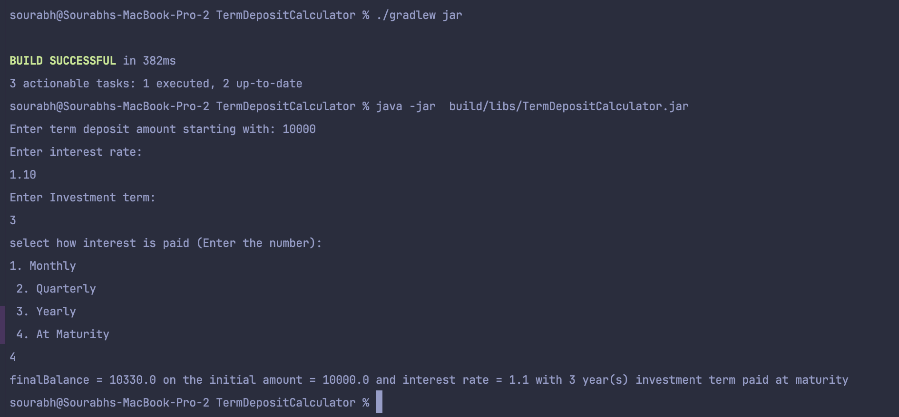
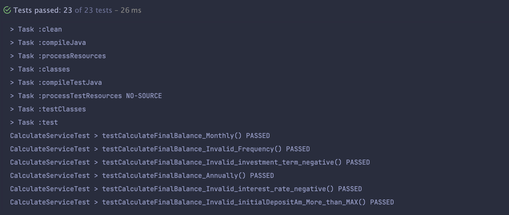

## Term Deposit Calculator
This is a simple deposit calculator based on the parameters and requirements given in the 
take-home-code-exercise.
pdf.

### Setup
- Language Used: Java (JDK 17)
- JDK version: JDK 17 Temurin aarch64
- Build system: Gradle (version 8.0)
- IDE: IntelliJ IDEA 2024.2.2 (Ultimate Edition)
- Test: JUnit5
- gradle DSL: Kotlin DSL
- external libraries: None

### Assumptions
- Setup :
  - initial setup is done with the help of IDE default `hello world` application to save time for setting up the project.
  - IDE suggestions and function naming are used for faster development time.
  - Main business logic and application code and tests is written in about 2-2:15 hrs following the guidelines in 
    the exercise while other things like readMe, couple of changes in build.gradle to show test output and jar 
    creation are done after that.

- Business Logic
  - Max initial term deposit amount is allowed to be 1,50,000.
  - investment term is taken in Years instead of months. 
  - Max investment term is 5
  - standard `java.Math` functions (`math.pow`, `math.round`) are used for calculation purposes. 

### Project structure
The start of the application is from `src/java` directory which has `TermDepositCalculator.java` which contains void main() 
method from where 
the 
application starts.
The overall project is divided in 3 main directories.
- model - it contains Record for `TermDeposit` model.
- service - it contains the business logic for the application
- utils - additional validation and frequency related classes with helpful functions.

The tests are under `src/test/java` directory which contain
- `CalculatorServiceTest` - Contains tests related to application business logic which calculates the final 
  balance based on the input provided
- `FrequencyTest`- Contains tests related to `Frequency` class
- `ValidationUtilTest` - Contains tests related to `ValidationUtil`class

### Design Decisions
- The application is based on the MVC architecture for separation of concerns where `TermDepositCalculator.java` is 
  used for getting input from user and showing output of final calculations.
- The service `CalculatorService` contains the business logic of the provided input. the parameters of `Monthly`, 
  `Quarterly` and `Annually` use the standard compound interest formula `A = P * (1 + (r / n)) ^ (n * t)`
- while `at maturity` uses simple interest based on the formula `A=P×(1+r×t)`
- model  `TermDeposit` uses Record feature from Java17 to hold the provided data.

### Setup and Running the application
To setup the application, first install the JDK 17 on the machine (Any will do, I'm using temurin from https://adoptium.net/temurin/releases/?version=17).

Gradle build system is used for the actions.

To create a executable jar, navigate to project root and perform

`./gradlew clean`

and perform

`./gradlew build`

followed by 

`./gradlew jar`

This will build the application and creates a executable jar inside `/build/libs` directory along with the test 
cases execution through `Task :test`

The executable jar can be invoked using

`java -jar  build/libs/TermDepositCalculator.jar`

This will show the output requesting user to input the parameters like follow

### running tests
The test task is configured in the `build.gradle.kts`. So to execute tests, we will need to perform

`./gradlew clean test` 

or 

`./gradlew clean build` 

which will show output as follows

### Things that can be improved
- Modifications to the program so that User can have more choices like start application, exit application
    (currently application completes the execution after showing result or getting error)
- The application calculates the investment term in Years. We can modify the term based on months for more 
  flexibility and further combination of year-months.
- Additional and informative validation for the user input
- Using Logger (e.g. SLF4j) instead of System.out.println everywhere
- Improvement to existing test cases as the test cases are duplicated with different params due to time constraints 
- Additional test cases for validation to handle more edge cases, like extremely high/low interest rates or very large 
  numbers.